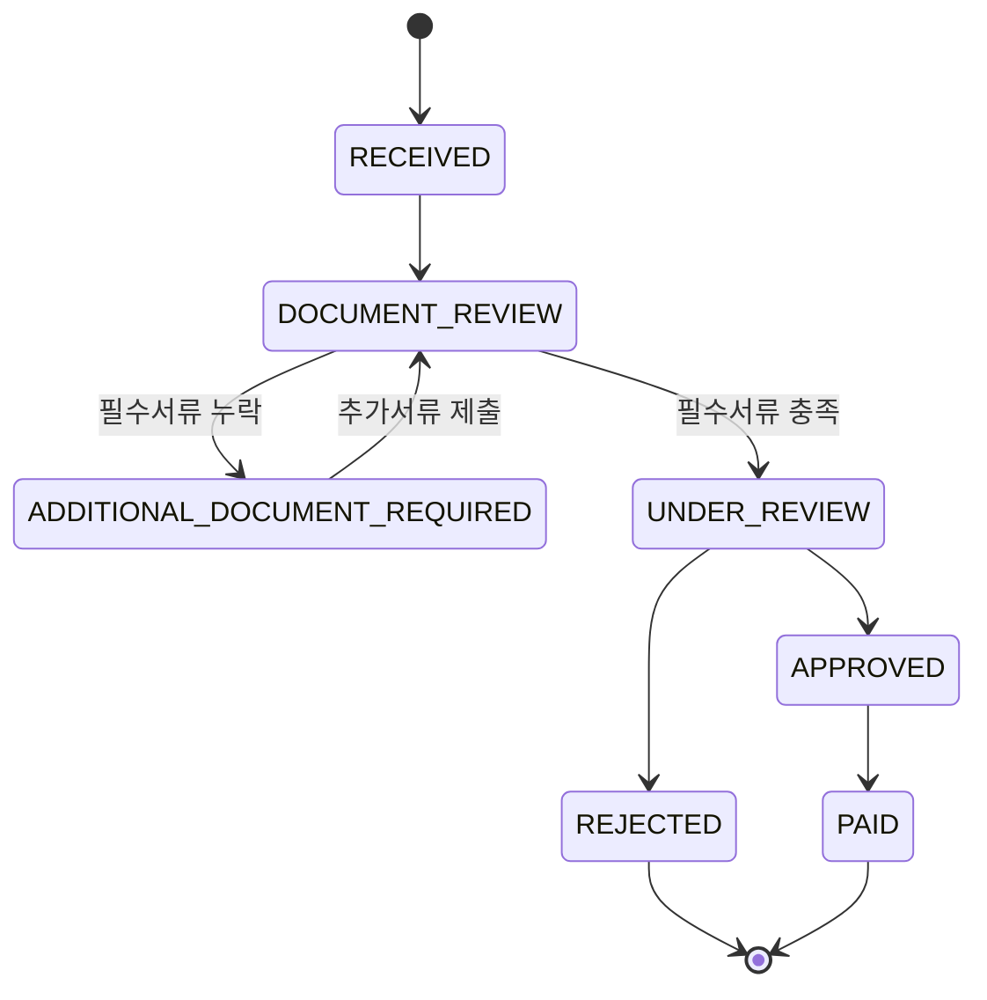
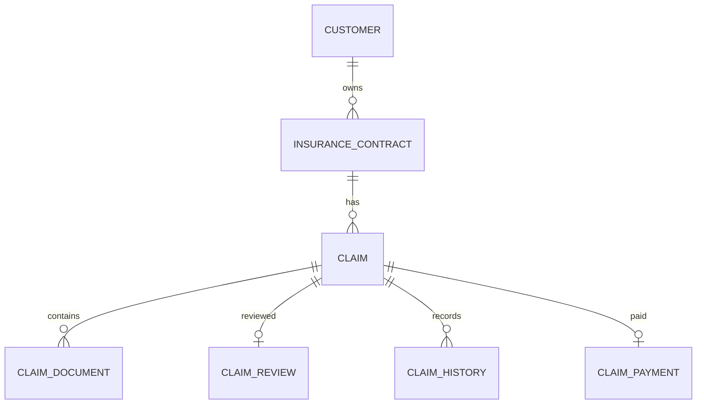
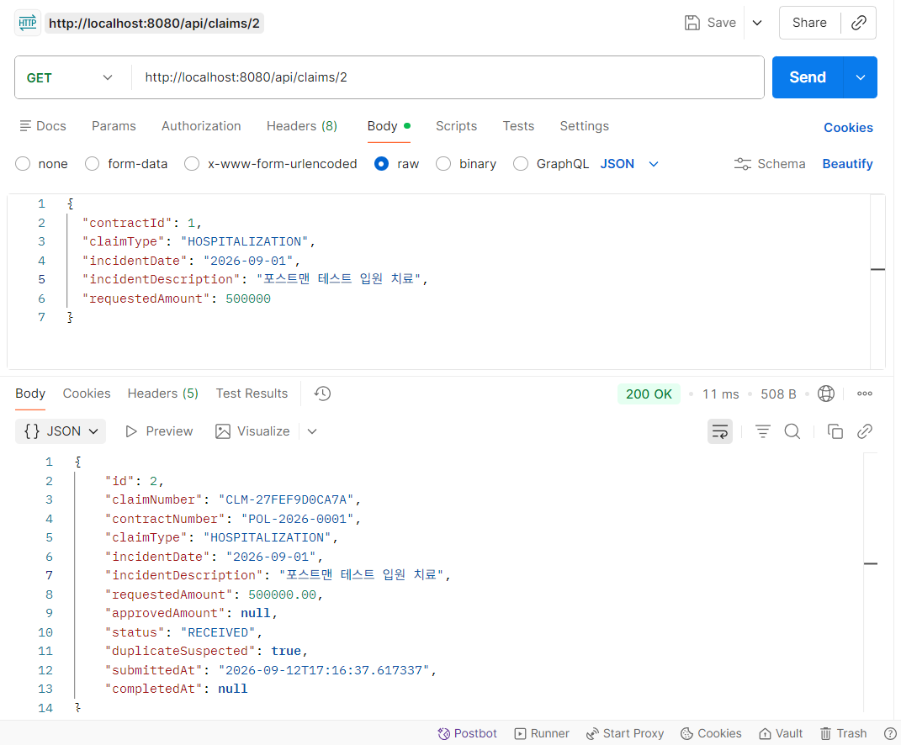
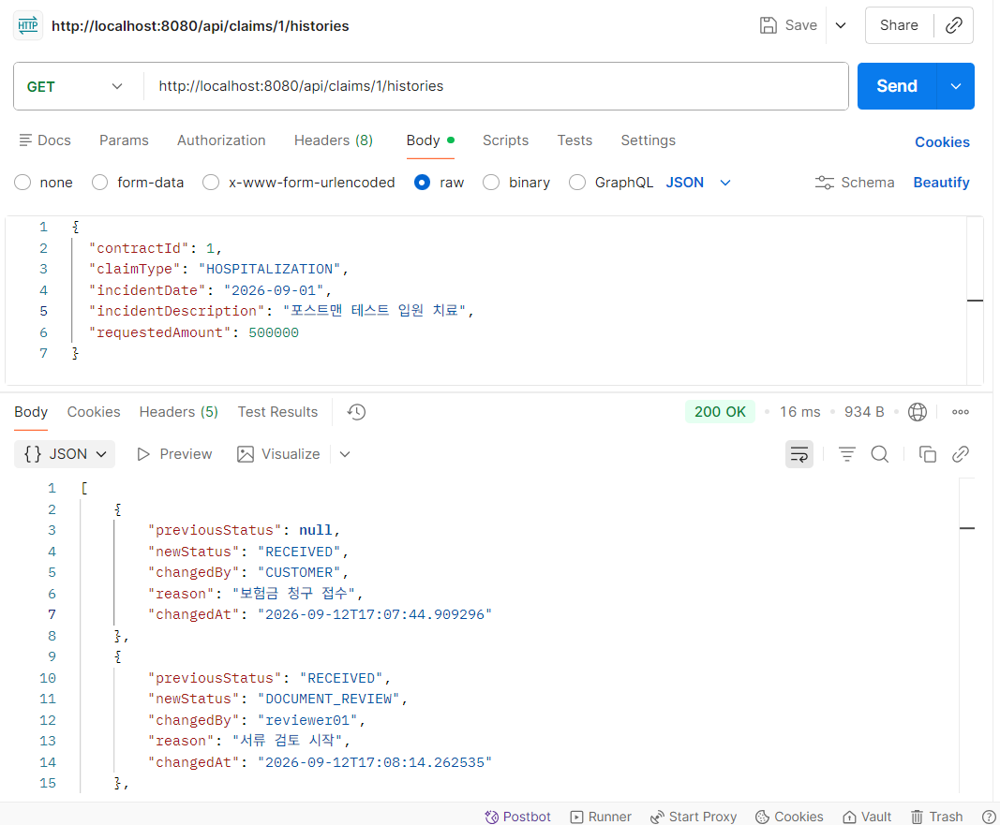
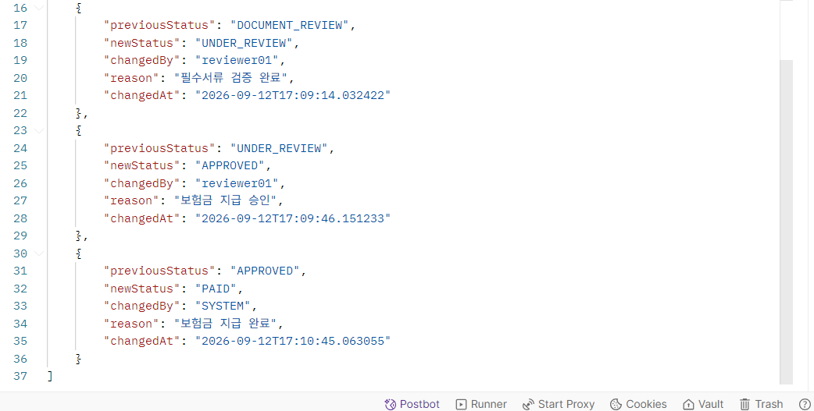
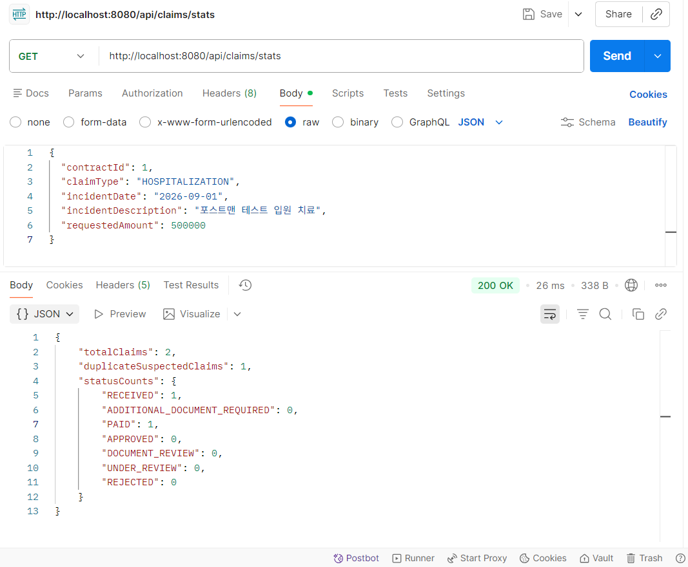

# Insurance Claim Workflow System

보험금 청구부터 서류 검토, 지급 심사, 승인 및 지급까지의 업무 흐름을 상태 기반으로 관리하는 보험업 미니프로젝트입니다.

보험회사 IT 직무를 준비하면서 단순 CRUD 구현보다 실제 보험 업무 흐름을 이해하고 이를 시스템 요구사항과 비즈니스 규칙으로 변환하는 것을 목표로 진행했습니다.

## 1. 프로젝트 개요

- 프로젝트 기간: 2026.09.08 ~ 2026.09.12
- 개발 인원: 1명
- 개발 환경: Java 21, Spring Boot 4.1.1, Spring Data JPA, MySQL, Gradle
- 테스트: JUnit, Spring Boot Integration Test
- API 검증: Postman, PowerShell

### 핵심 목표

보험금 청구 업무를 다음 흐름으로 모델링했습니다.

```text
보험계약 확인
→ 보험금 청구 접수
→ 서류 검토
→ 추가서류 요청
→ 지급 심사
→ 승인 또는 거절
→ 보험금 지급
```

단순한 데이터 등록과 조회가 아니라 다음 요소를 구현하는 데 중점을 두었습니다.

- 보험계약 유효성 검증
- 보험금 청구 상태 전이 관리
- 청구 유형별 필수서류 검증
- 중복 청구 의심 탐지
- 승인 금액 검증
- 중복 지급 방지
- 상태 변경 이력 관리
- 청구 현황 운영 통계

---

## 2. 보험금 청구 상태 흐름



각 상태는 임의로 변경할 수 없으며 도메인 객체에서 허용된 상태 전이만 수행하도록 구현했습니다.

예를 들어 RECEIVED 상태의 청구를 바로 APPROVED 또는 PAID 상태로 변경할 수 없습니다.

---

## 3. 주요 도메인

| Entity | 역할 |
|---|---|
| Customer | 고객 정보 |
| InsuranceContract | 보험계약과 보험기간 및 계약 상태 |
| Claim | 보험금 청구와 현재 처리 상태 |
| ClaimDocument | 청구 관련 제출서류 |
| ClaimReview | 지급심사 결과 |
| ClaimHistory | 상태 변경 이력 |
| ClaimPayment | 보험금 지급 내역 |

### 관계 구조



---

## 4. 주요 비즈니스 규칙

### 보험계약 검증

보험금 청구 시 다음 조건을 확인합니다.

```text
계약 상태가 ACTIVE인지 확인
사고 발생일이 보험기간에 포함되는지 확인
```

유효하지 않은 보험계약에서는 청구를 생성할 수 없습니다.

### 청구 유형별 필수서류

MVP에서는 청구 유형에 따라 간소화된 필수서류 규칙을 적용했습니다.

| 청구 유형 | 필수서류 |
|---|---|
| HOSPITALIZATION | 진단서, 입원확인서, 진료비영수증 |
| SURGERY | 수술확인서, 진료비영수증 |
| DIAGNOSIS | 진단서 |
| ACCIDENT | 사고확인서, 진료비영수증 |
| DEATH | 사망진단서 |

실제 보험사의 상품별 약관을 그대로 구현한 것이 아니라 보험금 청구 프로세스 학습을 위한 단순화된 규칙입니다.

### 중복 청구 의심 탐지

다음 조건이 같은 기존 청구가 존재하는 경우 중복 청구 가능성을 표시합니다.

```text
보험계약
사고 발생일
청구 유형
```

중복 가능성이 있다고 판단하더라도 자동 거절하지 않고 다음과 같이 표시하여 심사자가 확인할 수 있도록 설계했습니다.

```text
duplicateSuspected = true
```

### 지급 검증

지급은 APPROVED 상태에서만 가능합니다.

승인되지 않은 청구의 지급과 동일 청구의 중복 지급을 차단합니다.

---

## 5. 시스템 구조

```text
Client
  ↓
Controller
  ↓
Request DTO
  ↓
Service
  ↓
Domain Entity
  ↓
Repository
  ↓
MySQL
```

Controller는 HTTP 요청과 응답을 담당하고, 보험 업무 규칙은 Service와 Domain Entity에서 처리하도록 역할을 분리했습니다.

또한 Entity를 API에 직접 노출하지 않고 Request 및 Response DTO를 사용했습니다.

---

## 6. 주요 API

| Method | API | 기능 |
|---|---|---|
| POST | /api/claims | 보험금 청구 |
| GET | /api/claims/{claimId} | 청구 상세조회 |
| POST | /api/claims/{claimId}/document-review/start | 서류검토 시작 |
| POST | /api/claims/{claimId}/documents | 청구서류 등록 |
| GET | /api/claims/{claimId}/missing-documents | 누락서류 확인 |
| POST | /api/claims/{claimId}/documents/validate | 필수서류 검증 |
| POST | /api/claims/{claimId}/document-review/resume | 추가서류 제출 후 검토 재개 |
| POST | /api/claims/{claimId}/review/approve | 지급 승인 |
| POST | /api/claims/{claimId}/review/reject | 지급 거절 |
| POST | /api/claims/{claimId}/payment | 보험금 지급 |
| GET | /api/claims/{claimId}/histories | 처리이력 조회 |
| GET | /api/claims/stats | 운영 통계 |

---

## 7. 처리 이력 관리

모든 주요 상태 변경은 ClaimHistory에 저장합니다.

기록 정보는 다음과 같습니다.

```text
이전 상태
변경 상태
처리자
변경 사유
변경 시각
```

실제 테스트에서 다음 Workflow를 확인했습니다.

```text
RECEIVED
→ DOCUMENT_REVIEW
→ UNDER_REVIEW
→ APPROVED
→ PAID
```

이를 통해 현재 상태뿐 아니라 보험금 청구가 어떤 과정을 거쳐 처리되었는지 추적할 수 있습니다.

---

## 8. 운영 통계

보험금 처리 현황을 확인할 수 있도록 간단한 운영 API를 구현했습니다.

```json
{
  "totalClaims": 2,
  "duplicateSuspectedClaims": 1,
  "statusCounts": {
    "RECEIVED": 1,
    "ADDITIONAL_DOCUMENT_REQUIRED": 0,
    "PAID": 1,
    "APPROVED": 0,
    "DOCUMENT_REVIEW": 0,
    "UNDER_REVIEW": 0,
    "REJECTED": 0
  }
}
```

현재 처리 단계별 청구 건수와 중복 의심 청구 건수를 확인할 수 있습니다.

---

## 9. API 동작 확인

### 중복 청구 의심 탐지

동일 보험계약, 사고일, 청구 유형의 청구를 추가로 등록한 결과 중복 의심 청구로 표시되는 것을 확인했습니다.



### 상태 변경 이력

보험금 청구 접수부터 지급까지의 상태 변경과 처리자 및 처리 사유를 기록합니다.





### 처리 현황 통계



---

## 10. 테스트

도메인 단위 테스트와 Spring Context 테스트, MySQL 기반 통합 테스트를 수행했습니다.

| 테스트 영역 | 테스트 수 |
|---|---:|
| Claim Domain | 6 |
| InsuranceContract Domain | 2 |
| Spring Context | 1 |
| ClaimService Integration | 4 |
| Total | 13 |

총 13개의 테스트가 정상 통과했습니다.

### 주요 테스트 항목

```text
정상 상태 전이
잘못된 상태 전이 차단
보험기간 검증
승인금액 검증
미승인 청구 지급 차단
Spring Application Context 로딩
청구 생성 이력 저장
중복 청구 탐지
필수서류 누락 처리
청구 접수부터 지급까지 전체 Workflow

통합 테스트는 별도의 MySQL 테스트 데이터베이스를 사용하여 실제 Repository와 트랜잭션 흐름까지 검증했습니다.

---

## 11. 구현 과정에서의 주요 판단

### 중복 청구를 자동 거절하지 않은 이유

동일 계약과 동일 사고일의 청구라고 하더라도 실제 보험 업무에서는 추가적인 사실 확인이 필요할 수 있다고 판단했습니다.

따라서 자동 REJECTED 처리하지 않고 duplicateSuspected 속성을 통해 심사 대상임을 표시했습니다.

### 상태 변경을 Entity에서 관리한 이유

Service에서 단순히 status 값을 변경할 경우 허용되지 않은 상태 전이가 발생할 수 있습니다.

따라서 Claim 객체가 자신의 현재 상태를 확인한 뒤 허용된 경우에만 다음 상태로 변경하도록 구현했습니다.

### Entity와 API 모델을 분리한 이유

JPA Entity를 HTTP API에 직접 노출할 경우 내부 데이터 구조가 외부 API 구조와 강하게 결합됩니다.

Request DTO와 Response DTO를 별도로 만들어 API와 Persistence Model을 분리했습니다.

---

## 12. 한계 및 향후 확장

현재 프로젝트는 보험금 청구와 지급 프로세스를 학습하기 위한 MVP입니다.

향후 다음 기능으로 확장할 수 있습니다.

```text
사용자 및 심사자 인증과 권한 관리
실제 파일 업로드 및 저장
상품별 약관 기반 지급 규칙
처리 단계별 평균 소요시간 분석
보험금 이상 청구 탐지
대시보드 및 모니터링
클라우드 배포
```

또한 보험업종별 확장 시 SGI서울보증의 보증사고 및 구상권 관리, 재보험사의 출재 및 수재 계약과 재보험금 정산 업무를 별도의 도메인으로 확장할 수 있습니다.

---

## 13. 프로젝트를 통해 학습한 점

보험 시스템에서는 기능 구현 자체뿐 아니라 계약 유효성, 서류 충족 여부, 상태 전이, 지급 조건과 같은 업무 규칙을 시스템에서 일관되게 보장하는 것이 중요하다는 점을 확인했습니다.

특히 보험금 청구 업무를 분석한 뒤 요구사항과 상태 모델로 변환하고 이를 Domain, Service, Repository 및 API로 구현하면서 업무 이해에서 시스템 설계와 테스트까지 이어지는 전체 흐름을 경험했습니다.