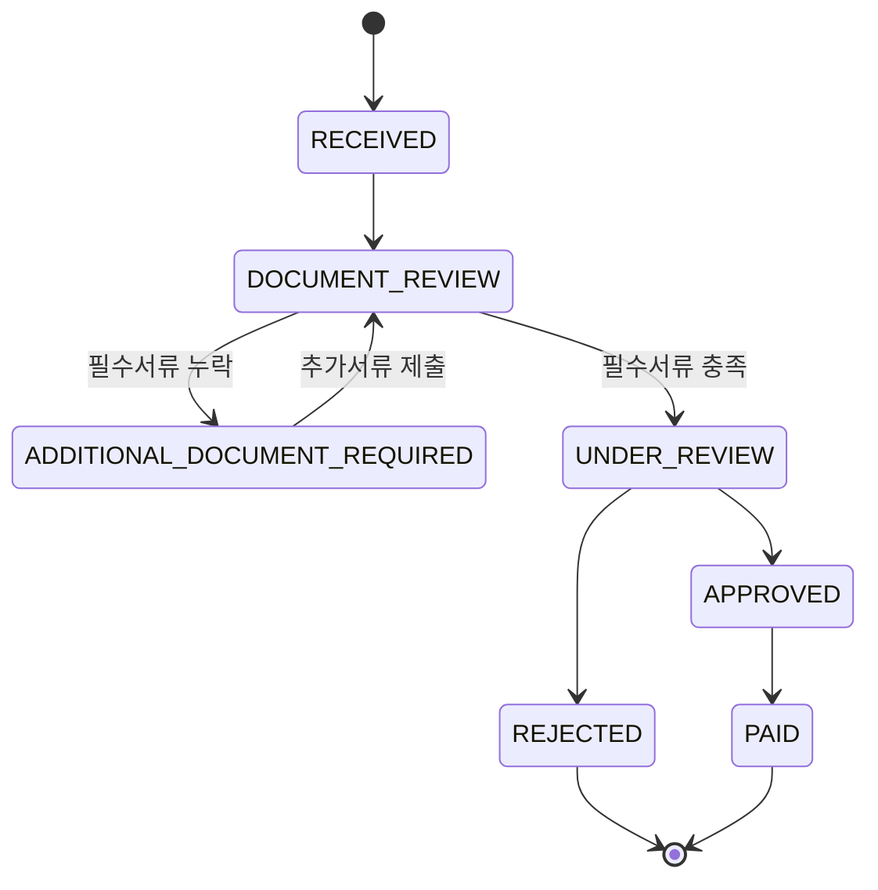
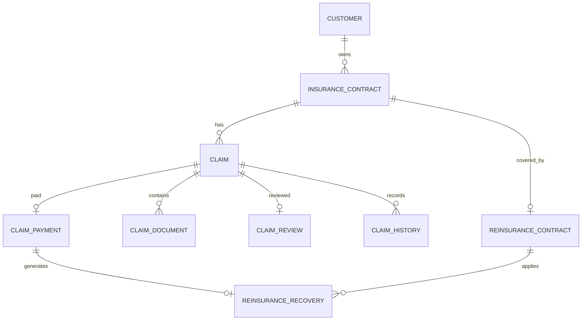
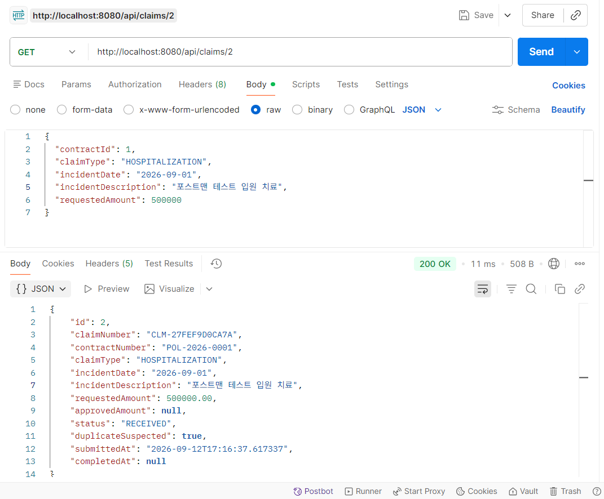
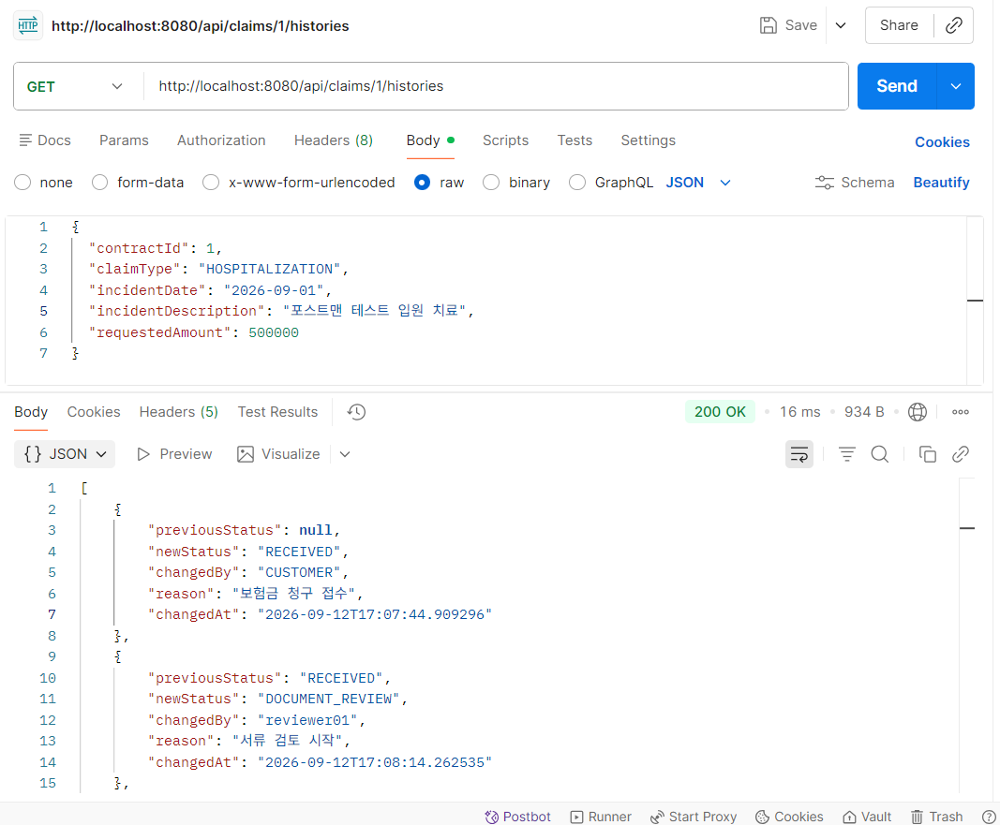
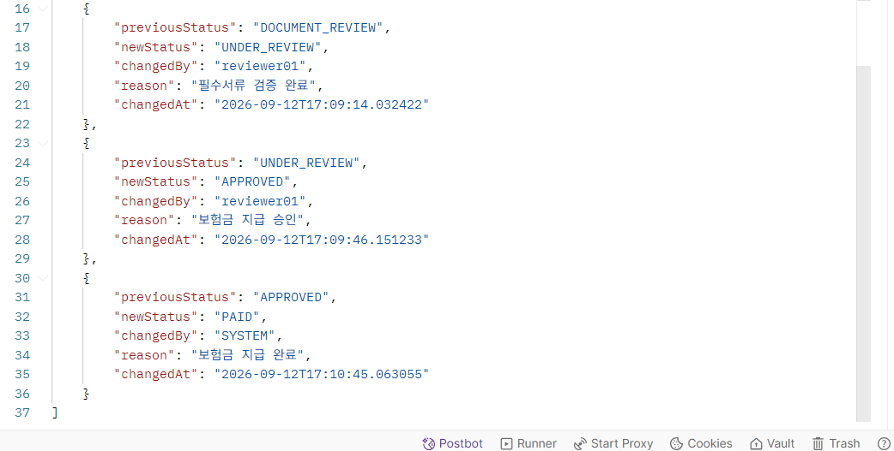
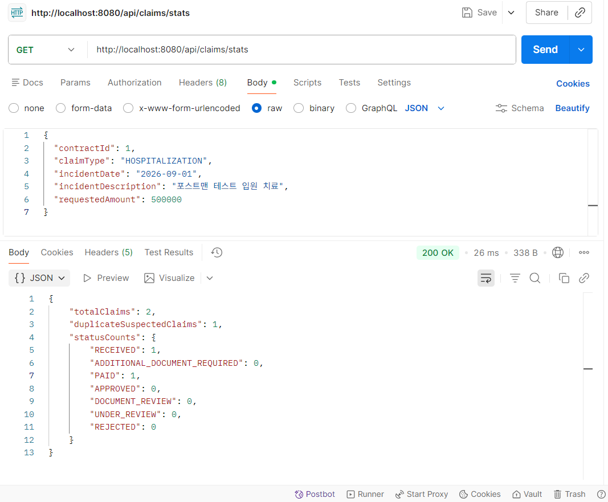

# Insurance Claim Workflow System

보험금 청구부터 서류 검토, 지급 심사, 승인 및 지급까지의 업무 흐름을 상태 기반으로 관리하고, 지급 이후 Quota Share 재보험 회수 및 원보험사 순부담액 계산까지 확장한 보험업 미니프로젝트입니다.

보험·금융 IT 직무를 준비하면서 단순 CRUD 구현보다 보험 업무를 이해하고, 이를 요구사항과 비즈니스 규칙 및 시스템 Workflow로 변환하는 것을 목표로 진행했습니다.

초기에는 원보험사의 보험금 청구·지급 업무를 구현했으며, 이후 재보험 업무를 학습하면서 실제 보험금 지급 이후 재보험사와의 손해 분담 및 정산 과정을 단순화하여 시스템에 추가했습니다.

---

## 1. 프로젝트 개요

- 프로젝트명: Insurance Claim Workflow System
- 개발 기간
    - 보험금 청구 Workflow: 2026.09.08 ~ 2026.09.12
    - Quota Share 재보험 확장: 2026.10.06
- 개발 인원: 1명
- 개발 언어: Java 21
- Framework: Spring Boot 4.1.1
- Persistence: Spring Data JPA
- Database: MySQL 8
- Build Tool: Gradle
- 테스트: JUnit, Spring Boot Test, MySQL Integration Test
- API 검증: Postman, PowerShell

### 핵심 목표

보험금 청구 업무를 다음과 같은 흐름으로 모델링했습니다.

```text
보험계약 확인
→ 보험금 청구 접수
→ 서류 검토
→ 필요 시 추가서류 요청
→ 지급 심사
→ 승인 또는 거절
→ 보험금 지급
→ 재보험 계약 확인
→ Quota Share 재보험 회수액 계산
→ 원보험사 순부담액 산출
```

단순 데이터 등록과 조회를 넘어 다음 업무 규칙을 시스템에서 보장하도록 구현했습니다.

- 보험계약 유효성 검증
- 보험금 청구 상태 전이 관리
- 청구 유형별 필수서류 검증
- 중복 청구 의심 탐지
- 승인금액 검증
- 미승인 청구 지급 차단
- 동일 청구 중복 지급 방지
- 상태 변경 이력 관리
- 보험금 청구 운영 통계
- Quota Share 재보험 계약 관리
- 실제 지급보험금 기준 재보험 회수액 계산
- 출재율 기반 원보험사 순부담액 산출
- 재보험 계약기간 검증
- 동일 지급건의 중복 재보험 회수 방지

---

## 2. 보험금 청구 상태 흐름


```mermaid
stateDiagram-v2
    [*] --> RECEIVED

    RECEIVED --> DOCUMENT_REVIEW

    DOCUMENT_REVIEW --> ADDITIONAL_DOCUMENT_REQUIRED : 필수서류 누락
    ADDITIONAL_DOCUMENT_REQUIRED --> DOCUMENT_REVIEW : 추가서류 제출

    DOCUMENT_REVIEW --> UNDER_REVIEW : 필수서류 충족

    UNDER_REVIEW --> APPROVED
    UNDER_REVIEW --> REJECTED

    APPROVED --> PAID

    REJECTED --> [*]
    PAID --> [*]
```

각 상태는 임의로 변경할 수 없으며 Domain Entity에서 허용된 상태 전이만 수행하도록 구현했습니다.

예를 들어 `RECEIVED` 상태의 청구를 바로 `APPROVED` 또는 `PAID` 상태로 변경할 수 없습니다.

보험금 지급이 완료된 이후에는 Claim의 상태를 추가로 변경하지 않고, 별도의 재보험 Domain을 통해 재보험 회수 및 정산 정보를 관리합니다.

```text
PAID
→ ClaimPayment 확인
→ ReinsuranceContract 확인
→ 출재율 적용
→ ReinsuranceRecovery 생성
```

---

## 3. 주요 도메인

| Entity | 역할 |
|---|---|
| Customer | 고객 정보 |
| InsuranceContract | 보험계약과 보험기간 및 계약 상태 |
| Claim | 보험금 청구와 현재 처리 상태 |
| ClaimDocument | 보험금 청구 관련 제출서류 |
| ClaimReview | 지급심사 결과 |
| ClaimHistory | 상태 변경 이력 |
| ClaimPayment | 보험금 지급 내역 |
| ReinsuranceContract | Quota Share 재보험 계약과 출재율 및 계약기간 관리 |
| ReinsuranceRecovery | 실제 지급보험금 기준 재보험 회수액 및 원보험사 순부담액 관리 |

### ERD


```mermaid
erDiagram
    CUSTOMER ||--o{ INSURANCE_CONTRACT : owns

    INSURANCE_CONTRACT ||--o{ CLAIM : has
    INSURANCE_CONTRACT ||--o| REINSURANCE_CONTRACT : covered_by

    CLAIM ||--o{ CLAIM_DOCUMENT : contains
    CLAIM ||--o| CLAIM_REVIEW : reviewed
    CLAIM ||--o{ CLAIM_HISTORY : records
    CLAIM ||--o| CLAIM_PAYMENT : paid

    CLAIM_PAYMENT ||--o| REINSURANCE_RECOVERY : generates
    REINSURANCE_CONTRACT ||--o{ REINSURANCE_RECOVERY : applies
```

주요 관계는 다음과 같습니다.

```text
Customer 1:N InsuranceContract

InsuranceContract 1:N Claim
InsuranceContract 1:0..1 ReinsuranceContract

Claim 1:N ClaimDocument
Claim 1:0..1 ClaimReview
Claim 1:N ClaimHistory
Claim 1:0..1 ClaimPayment

ClaimPayment 1:0..1 ReinsuranceRecovery
ReinsuranceContract 1:N ReinsuranceRecovery
```

현재 재보험 기능은 MVP이므로 하나의 원보험계약에 하나의 Quota Share 재보험계약이 연결되는 구조로 단순화했습니다.

---

## 4. 주요 비즈니스 규칙

### 4.1 보험계약 검증

보험금 청구 시 보험계약에 대해 다음 조건을 확인합니다.

```text
계약 상태가 ACTIVE인지 확인
사고 발생일이 보험기간에 포함되는지 확인
```

유효하지 않은 보험계약에서는 보험금 청구를 생성할 수 없습니다.

---

### 4.2 청구 유형별 필수서류

MVP에서는 청구 유형에 따라 단순화한 필수서류 규칙을 적용했습니다.

| 청구 유형 | 필수서류 |
|---|---|
| HOSPITALIZATION | 진단서, 입원확인서, 진료비영수증 |
| SURGERY | 수술확인서, 진료비영수증 |
| DIAGNOSIS | 진단서 |
| ACCIDENT | 사고확인서, 진료비영수증 |
| DEATH | 사망진단서 |
| OTHER | 별도 필수서류 없음 |

필수서류가 충족되지 않은 경우 청구 상태는 다음과 같이 변경됩니다.

```text
DOCUMENT_REVIEW
→ ADDITIONAL_DOCUMENT_REQUIRED
```

추가서류가 제출되면 다시 서류검토를 진행할 수 있습니다.

```text
ADDITIONAL_DOCUMENT_REQUIRED
→ DOCUMENT_REVIEW
```

실제 보험사의 상품별 약관을 그대로 구현한 것이 아니라 보험금 청구 Workflow 학습을 위한 단순화된 규칙입니다.

---

### 4.3 중복 청구 의심 탐지

다음 조건이 동일한 기존 청구가 존재하면 중복 청구 가능성이 있는 것으로 판단합니다.

```text
보험계약
사고 발생일
청구 유형
```

중복 청구 가능성이 있더라도 자동으로 거절하지 않습니다.

```text
duplicateSuspected = true
```

로 표시하여 심사자가 추가 확인할 수 있도록 설계했습니다.

보험 업무에서는 동일 조건의 청구라고 해도 실제 중복 청구인지 추가적인 사실 확인이 필요할 수 있다고 판단했기 때문입니다.

---

### 4.4 지급심사 및 지급 검증

보험금 지급 승인 시 다음 규칙을 적용합니다.

```text
현재 상태가 UNDER_REVIEW인지 확인
승인금액이 0보다 큰지 확인
승인금액이 청구금액을 초과하지 않는지 확인
```

보험금 지급은 `APPROVED` 상태에서만 가능합니다.

```text
APPROVED
→ PAID
```

승인되지 않은 청구의 지급과 동일 청구의 중복 지급을 차단합니다.

보험금 지급 내역은 `ClaimPayment`에 별도로 저장하며 실제 지급이 완료된 경우 `PaymentStatus.COMPLETED` 상태로 관리합니다.

---

### 4.5 Quota Share 재보험 계약

재보험은 원보험사가 인수한 위험의 일부를 재보험사에 이전하여 위험을 분산하는 방식입니다.

본 프로젝트에서는 비례재보험 중 가장 기본적인 구조인 Quota Share 방식을 학습 목적으로 단순화하여 구현했습니다.

Quota Share 계약에는 다음 정보를 관리합니다.

```text
재보험 계약번호
원보험계약
재보험사
재보험 유형
출재율
재보험 계약 시작일
재보험 계약 종료일
```

현재 지원하는 재보험 유형은 다음과 같습니다.

```text
QUOTA_SHARE
```

출재율은 0보다 크고 1 이하의 값으로 제한합니다.

예를 들어 출재율 40%는 다음과 같이 저장합니다.

```text
cessionRate = 0.40
```

또한 사고 발생일이 재보험 계약기간에 포함되는 경우에만 해당 재보험 계약을 적용할 수 있도록 검증합니다.

---

### 4.6 재보험 회수액 계산

보험금 지급 이후 해당 원보험계약에 Quota Share 재보험 계약이 존재하는 경우 실제 지급보험금을 기준으로 재보험 회수액을 계산합니다.

```text
재보험 회수액
= 실제 지급보험금 × 출재율
```

```text
원보험사 순부담액
= 실제 지급보험금 - 재보험 회수액
```

예를 들어 실제 지급보험금이 800,000원이고 출재율이 40%인 경우 다음과 같이 계산됩니다.

```text
총 지급보험금       800,000원
출재율                    40%

재보험 회수액       320,000원
원보험사 순부담액   480,000원
```

본 프로젝트에서는 승인금액 자체가 아니라 실제 지급이 완료된 `ClaimPayment.paymentAmount`를 기준으로 재보험 회수액을 계산하도록 설계했습니다.

재보험 회수 처리 시 다음 조건을 검증합니다.

```text
보험금 지급 내역 존재
→ 지급 상태가 COMPLETED인지 확인
→ 해당 원보험계약의 재보험계약 확인
→ 사고일이 재보험 계약기간에 포함되는지 확인
→ 동일 지급건의 재보험 회수 여부 확인
→ 회수액 및 순부담액 계산
→ ReinsuranceRecovery 저장
```

동일한 `ClaimPayment`에 대해 두 개 이상의 `ReinsuranceRecovery`가 생성되지 않도록 애플리케이션 검증과 DB Unique Constraint를 함께 적용했습니다.

실제 재보험 계약에는 보유액, 한도, 면책, 수수료, 다양한 Treaty 조건 등이 존재할 수 있으므로 본 프로젝트에서는 재보험 업무 흐름을 이해하기 위한 단순화된 Quota Share 모델을 사용했습니다.

---

## 5. 시스템 구조

```text
Client
  ↓
Controller
  ↓
Request DTO
  ↓
Service
  ↓
Domain Entity
  ↓
Repository
  ↓
MySQL
```

각 계층의 역할을 다음과 같이 분리했습니다.

| 계층 | 역할 |
|---|---|
| Controller | HTTP 요청과 응답 처리 |
| DTO | 외부 API 요청 및 응답 데이터 정의 |
| Service | 보험금 청구 및 재보험 업무 흐름 처리 |
| Domain Entity | 상태와 핵심 업무 규칙 관리 |
| Repository | 데이터베이스 접근 |
| MySQL | 보험계약, 청구, 지급 및 재보험 데이터 저장 |

JPA Entity를 API에 직접 노출하지 않고 Request DTO와 Response DTO를 별도로 사용했습니다.

보험 업무 규칙을 Controller에 집중시키지 않고 Service와 Domain Entity에서 관리하도록 구성했습니다.

재보험 기능 역시 기존 Claim Domain 내부에 무리하게 포함하지 않고 `reinsurance` Domain을 별도로 구성하여 보험금 청구 업무와 재보험 업무의 책임을 분리했습니다.

---

## 6. 주요 API

### 보험금 청구 API

| Method | API | 기능 |
|---|---|---|
| POST | `/api/claims` | 보험금 청구 접수 |
| GET | `/api/claims/{claimId}` | 청구 상세조회 |
| POST | `/api/claims/{claimId}/document-review/start` | 서류검토 시작 |
| POST | `/api/claims/{claimId}/documents` | 청구서류 등록 |
| GET | `/api/claims/{claimId}/missing-documents` | 누락서류 확인 |
| POST | `/api/claims/{claimId}/documents/validate` | 필수서류 검증 |
| POST | `/api/claims/{claimId}/document-review/resume` | 추가서류 제출 후 검토 재개 |
| POST | `/api/claims/{claimId}/review/approve` | 지급 승인 |
| POST | `/api/claims/{claimId}/review/reject` | 지급 거절 |
| POST | `/api/claims/{claimId}/payment` | 보험금 지급 |
| GET | `/api/claims/{claimId}/histories` | 처리이력 조회 |
| GET | `/api/claims/stats` | 보험금 청구 운영 통계 |

### 재보험 API

| Method | API | 기능 |
|---|---|---|
| POST | `/api/reinsurance/contracts` | Quota Share 재보험 계약 등록 |
| POST | `/api/reinsurance/recoveries/claims/{claimId}` | 지급 완료 보험금의 재보험 회수 처리 |
| GET | `/api/reinsurance/recoveries/claims/{claimId}` | 재보험 회수 결과 조회 |

재보험 계약 등록 요청 예시는 다음과 같습니다.

```json
{
  "insuranceContractId": 1,
  "reinsuranceContractNumber": "RE-QS-2026-001",
  "reinsurerName": "Korean Re",
  "cessionRate": 0.40,
  "startDate": "2026-01-01",
  "endDate": "2026-12-31"
}
```

보험금 800,000원이 지급되고 출재율이 40%인 경우 재보험 회수 결과는 다음과 같은 형태로 조회할 수 있습니다.

```json
{
  "recoveryId": 1,
  "claimId": 1,
  "reinsuranceContractNumber": "RE-QS-2026-001",
  "reinsurerName": "Korean Re",
  "cessionRate": 0.4000,
  "grossAmount": 800000.00,
  "recoveryAmount": 320000.00,
  "netAmount": 480000.00,
  "calculatedAt": "2026-10-06T17:00:00"
}
```

---

## 7. 처리 이력 관리

모든 주요 Claim 상태 변경은 `ClaimHistory`에 저장합니다.

다음 정보를 기록합니다.

```text
이전 상태
변경 상태
처리자
변경 사유
변경 시각
```

실제 API 테스트에서 다음 전체 Workflow를 확인했습니다.

```text
RECEIVED
→ DOCUMENT_REVIEW
→ UNDER_REVIEW
→ APPROVED
→ PAID
```

이를 통해 보험금 청구의 현재 상태뿐 아니라 어떤 과정을 거쳐 처리되었는지 추적할 수 있도록 구현했습니다.

재보험 회수는 Claim 상태를 추가로 변경하지 않고 별도의 `ReinsuranceRecovery` Entity로 저장하여 보험금 청구 처리 이력과 재보험 정산 데이터를 분리했습니다.

---

## 8. 운영 통계

보험금 청구 처리 현황을 확인할 수 있도록 운영 통계 API를 구현했습니다.

예시 응답은 다음과 같습니다.

```json
{
  "totalClaims": 2,
  "duplicateSuspectedClaims": 1,
  "statusCounts": {
    "RECEIVED": 1,
    "ADDITIONAL_DOCUMENT_REQUIRED": 0,
    "PAID": 1,
    "APPROVED": 0,
    "DOCUMENT_REVIEW": 0,
    "UNDER_REVIEW": 0,
    "REJECTED": 0
  }
}
```

다음 정보를 한 번에 확인할 수 있습니다.

- 전체 보험금 청구 건수
- 중복 의심 청구 건수
- 상태별 보험금 청구 건수

단순 처리 기능을 넘어 운영자가 현재 보험금 청구 처리 현황을 확인할 수 있도록 구성했습니다.

---

## 9. API 동작 확인

### 9.1 중복 청구 의심 탐지

동일 보험계약, 사고일, 청구 유형으로 두 번째 청구를 생성한 결과 중복 의심 청구로 표시되는 것을 확인했습니다.

```text
status = RECEIVED
duplicateSuspected = true
```

중복 의심 청구를 자동 거절하지 않고 정상 접수 상태로 유지했습니다.



---

### 9.2 상태 변경 이력

보험금 청구 접수부터 지급까지 상태 변경과 처리자, 변경 사유 및 시간을 기록합니다.

초기 처리 이력:



지급심사부터 지급 완료까지의 처리 이력:



실제 검증된 상태 흐름은 다음과 같습니다.

```text
RECEIVED
→ DOCUMENT_REVIEW
→ UNDER_REVIEW
→ APPROVED
→ PAID
```

---

### 9.3 보험금 청구 운영 통계

전체 청구 건수와 중복 의심 건수 및 상태별 처리 현황을 조회했습니다.



---

### 9.4 Quota Share 재보험 회수

보험금 지급 완료 이후 해당 원보험계약에 Quota Share 재보험 계약을 적용하고 재보험 회수액을 계산했습니다.

검증 시나리오:

```text
보험금 청구금액       1,000,000원
보험금 승인금액         800,000원
실제 지급보험금         800,000원
Quota Share 출재율           40%
```

계산 결과:

```text
재보험 회수액           320,000원
원보험사 순부담액       480,000원
```

또한 동일 지급 건에 대한 재보험 회수 요청을 다시 수행하는 경우 중복 처리가 차단되고, 지급 상태가 `COMPLETED`가 아닌 경우에도 재보험 회수 처리가 차단되도록 검증했습니다.

---

## 10. 테스트

도메인 단위 테스트와 Spring Application Context 테스트, MySQL 기반 통합 테스트를 수행했습니다.

| 테스트 영역 | 테스트 수 |
|---|---:|
| Claim Domain | 6 |
| InsuranceContract Domain | 2 |
| Spring Context | 1 |
| ClaimService Integration | 4 |
| ReinsuranceService Integration | 3 |
| **Total** | **16** |

**총 16개의 테스트가 정상 통과했습니다.**

### 주요 테스트 항목

```text
정상 상태 전이
잘못된 상태 전이 차단
보험기간 검증
승인금액 검증
미승인 청구 지급 차단
Spring Application Context 로딩
청구 생성 이력 저장
중복 청구 탐지
필수서류 누락 처리
청구 접수부터 지급까지 전체 Workflow

Quota Share 재보험 회수액 계산
동일 지급건의 중복 재보험 회수 차단
보험금 지급 완료 전 재보험 회수 차단
```

단위 테스트뿐 아니라 별도의 MySQL 테스트 데이터베이스를 사용한 통합 테스트를 통해 실제 Repository와 Service 및 트랜잭션 흐름까지 검증했습니다.

개발용 데이터베이스와 테스트용 데이터베이스를 분리했습니다.

```text
개발 DB
insurance_claim

테스트 DB
insurance_claim_test
```

최종 전체 테스트 실행 결과:

```text
BUILD SUCCESSFUL
```

---

## 11. 구현 과정에서의 주요 판단

### 11.1 중복 청구를 자동 거절하지 않은 이유

동일 보험계약과 동일 사고일 및 동일 청구 유형이라고 하더라도 실제 보험 업무에서는 추가적인 사실 확인이 필요할 수 있다고 판단했습니다.

따라서 자동으로 `REJECTED` 처리하지 않고 다음과 같이 표시했습니다.

```text
duplicateSuspected = true
```

이를 통해 시스템은 이상 가능성을 알려주고 최종 판단은 지급심사 단계에서 수행할 수 있도록 설계했습니다.

---

### 11.2 상태 변경을 Domain Entity에서 관리한 이유

Service에서 단순히 `status` 값을 직접 변경할 경우 허용되지 않은 상태 전이가 발생할 수 있습니다.

따라서 `Claim` 객체가 자신의 현재 상태를 확인하고 허용된 경우에만 다음 상태로 변경하도록 구현했습니다.

예를 들어 다음과 같은 비정상 흐름을 차단합니다.

```text
RECEIVED
→ PAID
```

정상적인 업무 흐름은 다음 상태를 순서대로 거쳐야 합니다.

```text
RECEIVED
→ DOCUMENT_REVIEW
→ UNDER_REVIEW
→ APPROVED
→ PAID
```

---

### 11.3 Entity와 API 모델을 분리한 이유

JPA Entity를 HTTP API에 직접 노출하면 내부 데이터 구조와 외부 API가 강하게 결합될 수 있습니다.

따라서 Request DTO와 Response DTO를 별도로 만들어 API 모델과 Persistence Model을 분리했습니다.

이를 통해 외부에 필요한 정보만 노출하고 API 구조와 데이터베이스 구조의 결합도를 낮췄습니다.

---

### 11.4 처리 이력을 별도 Entity로 관리한 이유

현재 상태만 저장하면 보험금 청구가 어떤 과정을 거쳐 처리되었는지 확인하기 어렵습니다.

따라서 모든 주요 상태 변경 시 다음 정보를 `ClaimHistory`에 기록했습니다.

```text
previousStatus
newStatus
changedBy
reason
changedAt
```

이를 통해 운영 및 감사 관점에서 처리 과정을 추적할 수 있도록 구성했습니다.

---

### 11.5 재보험 기능을 별도 Domain으로 분리한 이유

보험금 청구와 재보험 정산은 서로 연결되어 있지만 동일한 업무는 아닙니다.

기존 `Claim` Domain 내부에 재보험 관련 필드와 로직을 직접 추가할 경우 보험금 청구 업무와 재보험 업무의 책임이 혼재될 수 있다고 판단했습니다.

따라서 다음과 같이 분리했습니다.

```text
Claim Domain
→ 보험금 청구
→ 서류 검토
→ 지급 심사
→ 보험금 지급

Reinsurance Domain
→ 재보험 계약
→ 출재율 관리
→ 지급 완료 확인
→ 재보험 회수액 계산
→ 순부담액 관리
```

이를 통해 기존 보험금 청구 Workflow를 유지하면서 재보험 업무를 독립적으로 확장할 수 있도록 구성했습니다.

---

### 11.6 승인금액이 아닌 실제 지급보험금을 사용한 이유

보험금 지급 승인과 실제 지급은 서로 다른 단계입니다.

따라서 재보험 회수액 계산 시 `Claim.approvedAmount`를 직접 사용하는 대신 실제 지급 내역인 `ClaimPayment.paymentAmount`를 기준으로 계산했습니다.

```text
승인
→ 실제 지급
→ 지급 완료 확인
→ 재보험 회수
```

이를 통해 재보험 회수 계산이 실제 지급된 보험금과 연결되도록 설계했습니다.

---

### 11.7 재보험 회수 중복을 이중으로 방지한 이유

금융·보험 시스템에서는 동일 거래가 반복 처리될 경우 금액 데이터의 정합성이 훼손될 수 있습니다.

따라서 동일 `ClaimPayment`에 대해 재보험 회수 내역이 이미 존재하는지 Service에서 확인하고, 데이터베이스에서도 `claim_payment_id`에 Unique Constraint를 적용했습니다.

```text
Application 검증
+
Database Unique Constraint
```

두 단계로 중복 생성을 방지하도록 구성했습니다.

---

## 12. 예외 처리

잘못된 요청이나 허용되지 않은 상태 전이를 API에서 명확하게 확인할 수 있도록 전역 예외처리를 구현했습니다.

보험금 청구 영역의 주요 예외 유형은 다음과 같습니다.

```text
입력값 Validation 실패
유효하지 않은 보험계약
보험기간 외 사고일
허용되지 않은 상태 전이
승인금액 오류
중복 서류 제출
중복 지급 요청
```

재보험 영역에서는 다음과 같은 업무 오류를 추가로 검증합니다.

```text
존재하지 않는 원보험계약
기존 재보험계약 중복 등록
잘못된 출재율
유효하지 않은 재보험 계약기간
보험금 지급 내역 없음
보험금 지급 미완료
적용 가능한 재보험계약 없음
재보험 계약기간 외 사고
동일 지급건의 중복 재보험 회수
```

허용되지 않은 상태 전이는 HTTP `409 Conflict`, 잘못된 입력값은 HTTP `400 Bad Request` 형태로 처리하도록 구성했습니다.

---

## 13. 프로젝트를 통해 학습한 점

이번 프로젝트에서는 보험금 청구 기능 자체보다 보험 업무를 시스템 규칙으로 변환하는 과정에 중점을 두었습니다.

보험금 청구 업무를 분석하면서 다음 요소가 중요하다는 점을 확인했습니다.

```text
보험계약의 유효성
사고 발생일과 보험기간
청구 유형별 필수서류
업무 단계별 상태 전이
지급 승인 조건
중복 청구 처리
중복 지급 방지
처리 이력 관리
운영 현황 확인
```

이후 재보험 업무를 추가로 학습하면서 보험금 지급 이후에도 원보험사가 모든 손실을 최종적으로 부담하는 것이 아니라, 재보험 계약에 따라 위험과 손실을 재보험사와 분담할 수 있다는 점을 시스템 흐름에 반영했습니다.

재보험 확장을 통해 다음 과정을 구현했습니다.

```text
원보험계약
→ 보험금 청구
→ 보험금 지급
→ 재보험계약 확인
→ 출재율 확인
→ 재보험 회수액 계산
→ 원보험사 순부담액 계산
```

이를 통해 단순히 API를 구현하는 것보다 다음과 같은 과정이 중요하다는 점을 학습했습니다.

```text
보험 업무 이해
→ 문제 정의
→ 요구사항 정리
→ 상태 및 데이터 모델 설계
→ 업무 규칙 구현
→ REST API 구현
→ 테스트
→ 운영 관점 검증
→ 새로운 보험 Domain으로 확장
→ 문서화
```

또한 금융·보험 시스템에서는 동일 거래의 중복처리 방지, 실제 지급 데이터 기준의 정산, 계약기간 검증과 같은 데이터 정합성과 추적 가능성이 중요하다는 점을 확인했습니다.

---

## 14. 한계 및 향후 확장

현재 프로젝트는 보험금 청구 및 지급심사와 기본적인 Quota Share 재보험 회수 프로세스를 학습하기 위한 MVP입니다.

보험금 청구 영역에서는 향후 다음과 같은 기능으로 확장할 수 있습니다.

```text
사용자 및 심사자 인증과 권한 관리
실제 청구서류 파일 업로드 및 저장
보험상품별 약관 기반 지급 규칙
처리 단계별 평균 소요시간 분석
보험금 이상 청구 탐지
운영 대시보드 및 모니터링
클라우드 배포
```

### 보증보험 확장

현재 공통 보험금 청구 Workflow를 활용하여 다음과 같은 보증보험 업무로 확장할 수 있습니다.

```text
보증계약
보증사고
보험금 지급
구상권 및 회수 관리
```

### 재보험 업무 확장

현재는 하나의 원보험계약에 하나의 Quota Share 재보험계약이 연결되는 구조와 실제 지급보험금 기준의 재보험 회수액 계산을 구현했습니다.

향후에는 다음과 같은 기능으로 확장할 수 있습니다.

```text
다양한 비례재보험 방식
Excess of Loss 등 비비례재보험
재보험료 및 수수료 정산
복수 재보험 계약
보유액 및 한도 관리
재보험 손해 정산 상태 관리
재재보험
다중 통화 및 해외 거래 처리
브로커 및 보험사 외부 데이터 연계
결산 및 회계 시스템 연계
```

실제 재보험 업무는 계약구조와 정산조건이 훨씬 복잡하므로 현재 구현은 Quota Share의 핵심 개념과 시스템 처리 흐름을 이해하기 위한 단순화된 모델입니다.

---

## 15. 프로젝트 요약

보험금 청구 및 지급심사 업무를 분석하여 보험계약 확인부터 청구 접수, 필수서류 검증, 지급심사, 승인 및 지급까지의 상태 기반 Workflow를 구현했습니다.

중복 청구 의심 탐지, 잘못된 상태 전이 차단, 승인금액 검증, 중복 지급 방지, 처리 이력 관리 및 운영 통계를 구현했습니다.

이후 재보험 업무를 학습하여 기존 보험금 청구 시스템을 Quota Share 재보험 영역으로 확장했습니다.

실제 지급이 완료된 보험금을 기준으로 출재율을 적용하여 재보험 회수액과 원보험사 순부담액을 계산하고, 재보험 계약기간 검증과 동일 지급건의 중복 회수 방지를 구현했습니다.

총 16개의 Domain, Context 및 MySQL 기반 통합 테스트를 통해 보험금 청구부터 지급, 재보험 회수까지의 주요 업무 규칙과 전체 Workflow를 검증했습니다.

단순 CRUD 개발보다 보험 및 재보험 업무를 이해하고 이를 요구사항, Domain Model, 비즈니스 규칙과 시스템 Workflow로 변환하는 경험을 확보하는 것을 프로젝트의 핵심 목표로 삼았습니다.